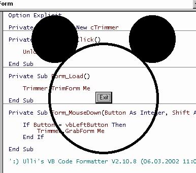



## Irregular shaped forms

### Description

Class to create an irregular shaped form from a picture. The screen shot sample shows an MM-shaped form and the ears, the black circle and the button make up the form. The remainder inside the circle does not belong to the form.
 
### More Info
 

             |
---                |---
**Submitted On**   |2002-03-06 11:45:02
**By**             |[ULLI](https://github.com/Planet-Source-Code/PSCIndex/blob/master/ByAuthor/ulli.md)
**Level**          |Intermediate
**User Rating**    |4.8 (58 globes from 12 users)
**Compatibility**  |VB 6\.0
**Category**       |[Graphics](https://github.com/Planet-Source-Code/PSCIndex/blob/master/ByCategory/graphics__1-46.md)
**World**          |[Visual Basic](https://github.com/Planet-Source-Code/PSCIndex/blob/master/ByWorld/visual-basic.md)
**Archive File**   |[Irregular\_59735362002\.zip](https://github.com/Planet-Source-Code/ulli-irregular-shaped-forms__1-32396/archive/master.zip)

